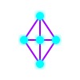
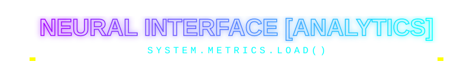

<div align="center">
  
  

  ###  Building Full Stack Web Applications, One Bug at a Time 
  
  *Student | Full Stack Web Developer*
  
  [](https://git.io/typing-svg)

</div>

---

## ⚡ Main Protocol: INITIALIZED 

<div align="center">
  
</div>

<br>

<table width="100%">
<tr>
<td width="50%" valign="top">

### 👾 About Me

I'm a **Student & Full Stack Web Developer** building product-ready web experiences with React, Node.js, and MongoDB. I enjoy turning ideas into working apps and learning every day through real projects.

🔹 **Core Focus:** Full stack web apps, REST APIs, developer tools, and open-source learning.<br>
🔹 **Design Philosophy:** Build fast, learn faster, and ship clean code.<br>
🔹 **Open Source:** Always keen to collaborate and contribute.<br>
🔹 **Email:** yusufsid87842@gmail.com

</td>
<td width="50%" valign="top">

### 🎯 Current Focus & Interests

- 🌱 **Learning:** React.js, Node.js, MongoDB, TypeScript
- 🚀 **Building:** Full stack web applications and modern dashboards
- 🔭 **Exploring:** Open source workflows and developer tooling
- 🤝 **Open To:** Collaboration, beginner-friendly projects, mentorship
- 🛠 **Growing With:** JavaScript, Python, Java, Git & GitHub
- ⚡ **Fun Fact:** Creating bugs since day one 😂

</td>
</tr>
</table>

<div align="center">
  
</div>

---

## 🚧 What I Build

- **Responsive web apps** with React / Next.js for modern user experiences.
- **APIs and backend services** using Node.js, Express, and MongoDB.
- **Developer-focused tools** and README-driven portfolio enhancements.
- **Learning projects** that turn concepts into real code.

---

## 🧠 Skill Highlights

Here’s a quick snapshot of the areas I’m building and improving right now:

- **Frontend:** React, Next.js, HTML, CSS, JavaScript
- **Backend:** Node.js, Express, REST APIs
- **Databases:** MongoDB, MySQL, Supabase
- **Tools & Workflow:** Git, GitHub, Postman, Vercel, VS Code
- **Learning Path:** TypeScript, Python, Java, Docker

## 🛠️ Technological Arsenal

### 💻 Primary Languages
A few of the languages I use most often when building apps, tools, and learning new concepts.


### 🎨 Frontend & Backend


### 🗄️ Databases


### 🧠 Data & Machine Learning


### ☁️ Tools & Platforms


---

## 🎯 Current Focus

<table width="100%">
  <tr>
    <td width="25%" align="center"><b>🌱 Learning</b></td>
    <td width="75%">React.js · Node.js · MongoDB · Advanced JavaScript</td>
  </tr>
  <tr>
    <td width="25%" align="center"><b>🚀 Building</b></td>
    <td width="75%">Full stack web applications</td>
  </tr>
  <tr>
    <td width="25%" align="center"><b>🔭 Exploring</b></td>
    <td width="75%">Open source contribution workflows</td>
  </tr>
  <tr>
    <td width="25%" align="center"><b>🤝 Open To</b></td>
    <td width="75%">Open source projects · Web dev collaboration · Beginner-friendly project ideas</td>
  </tr>
</table>

<div align="center">
  
</div>

---

<div align="center">
  
</div>

<div align="center">

### Contribution Grid Matrix
<!-- The Snake Action pushes to the dist/output branch. Give it a minute after running the workflow! -->
<picture>
  <source media="(prefers-color-scheme: dark)" srcset="https://raw.githubusercontent.com/sidyusufdev/sidyusufdev/output/github-contribution-grid-snake-dark.svg">
  <source media="(prefers-color-scheme: light)" srcset="https://raw.githubusercontent.com/sidyusufdev/sidyusufdev/output/github-contribution-grid-snake.svg">
  
</picture>

<br>

### 3D Contribution Render
<!-- Note: The 3D render is generated by the GitHub Actions workflow. Once the "3d.yml" action finishes running in your repository, this image will automatically appear! -->


<br>

### Stats & Activity Log

<table width="100%">
  <tr>
    <td width="50%" align="center">
      
    </td>
    <td width="50%" align="center">
      
    </td>
  </tr>
</table>


### ⏱️ WakaTime Stats

<!--START_SECTION:waka-->

```txt
From: 30 July 2026 - To: 06 August 2026

Total Time: 58 mins

Markdown          38 mins               ████████████████▓░░░░░░░░   66.42 %
Java              6 mins                ██▓░░░░░░░░░░░░░░░░░░░░░░   11.04 %
Java Properties   6 mins                ██▓░░░░░░░░░░░░░░░░░░░░░░   10.96 %
XML               3 mins                █▓░░░░░░░░░░░░░░░░░░░░░░░   06.30 %
Git               0 secs                ▒░░░░░░░░░░░░░░░░░░░░░░░░   01.70 %
```

<!--END_SECTION:waka-->


</div>

---

<div align="center">
  
</div>

<div align="center">

**Connect with me on GitHub or by email.**

<a href="https://github.com/sidyusufdev">
  
</a>
<a href="mailto:yusufsid87842@gmail.com">
  
</a>

<br><br>

<div align="center">
  
</div>

<br>

<div align="center">
  <h3>⚡ SYSTEM VISITS ⚡</h3>
  
</div>

</div>
